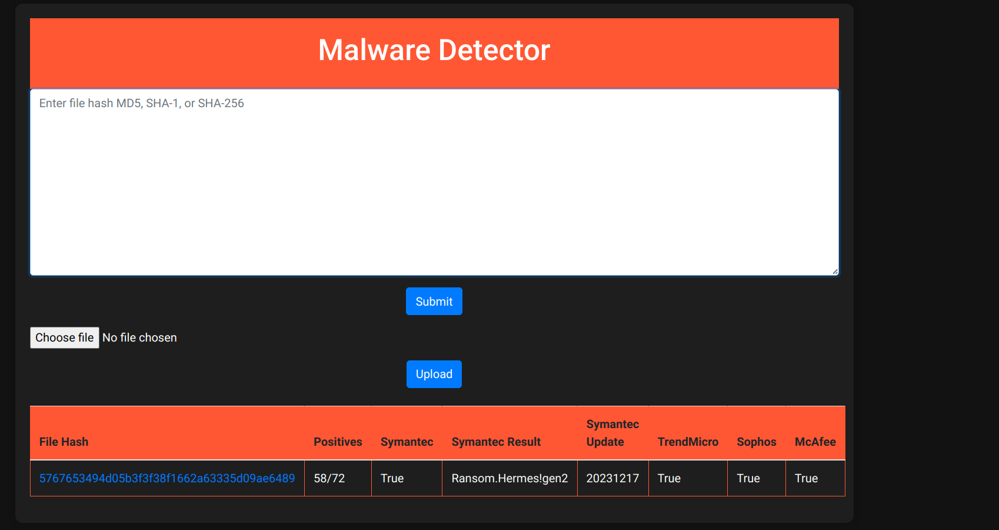

# Malware Checker App Documentation

## Introduction
The Malware Checker web application built using Flask interacts with the mawlareTotal API to determine if a file is identified as a mawlare by various antimawlare engines. It allows users to upload a file or input a hash value to perform a mawlare scan and obtain the scan results.
## Setup

### Virtual Environment Setup

#### Create a Virtual Environment
1. Open a terminal or command prompt.
2. Clone or Download the project
3. Navigate to the project directory.
4. Run the following command to create a virtual environment named `venv`:
   ```
   python -m venv venv
   ```

#### Activate the Virtual Environment
- Activate the virtual environment based on your operating system:

   - **Windows**:
     ```
     venv\Scripts\activate
     ```

   - **Mac/Linux**:
     ```
     source venv/bin/activate
     ```

### Installation

#### Install Dependencies
1. Ensure the virtual environment is activated.
2. Run the following command to install required dependencies from `requirements.txt`:
   ```
   pip install -r requirements.txt
   ```
### Configuration

#### Environment File Setup
1. Create a new file named `.env` in the root directory of the project.
2. Add the following line to the `.env` file:
   ```
   KEY=YOUR_API_KEY_HERE
   ```
   Replace `YOUR_API_KEY_HERE` with your actual VirusTotal API key.

#### Loading Environment Variables
- The Flask app is configured to load environment variables using the `python-dotenv` library.
- Ensure the `python-dotenv` package is installed by running:
  ```
  pip install python-dotenv
  ```

### Running the Application
1. Execute `main.py`.
2. Access the application through a web browser at `http://localhost:5001`.

### Functionality
- **Upload File**: Allows users to upload a file for mawlare scanning.
- **Input Hash Value**: Accepts a hash value to perform a mawlare scan.
- **Scan Results**: Displays scan results from various antivirus engines along with the detection status.

### Updating API Key
- To update the VirusTotal API key:
  1. Modify the value in the `.env` file for `KEY`.
  2. Restart the Flask application for the changes to take effect.

## Code Structure

### Files
- **main.py**: Contains the Flask application logic for handling file uploads, hash inputs, and interacting with the VirusTotal API.
- **requirements.txt**: Lists the required Python packages.

### main.py
- **Libraries**: Imports necessary libraries and modules for Flask, file handling, API requests, etc.
- **Configuration**: Sets up default variables, API URL, headers, proxy settings, and upload folder.
- **Routes**:
  - `home()`: Defines the application's main route handling file uploads, hash inputs, and displaying scan results.
- **Functions**:
  - `findHashatVT(hashValue)`: Sends a request to the VirusTotal API for file analysis and retrieves scan results.

### Execution
- The Flask app runs on port 5001 by default and can be accessed in a web browser. To be noted a default hash is hardcoded for demo. Please remove it if unnecassary
- A Deployed Demo is available at :- [Demo](https://nadvt.onrender.com)

## Screenshots




## Conclusion
The mawlare Checker app provides a simple interface to check files against the VirusTotal database and presents scan results from multiple antivirus engines. It serves as a starting point for integrating mawlare scanning functionality into applications.
